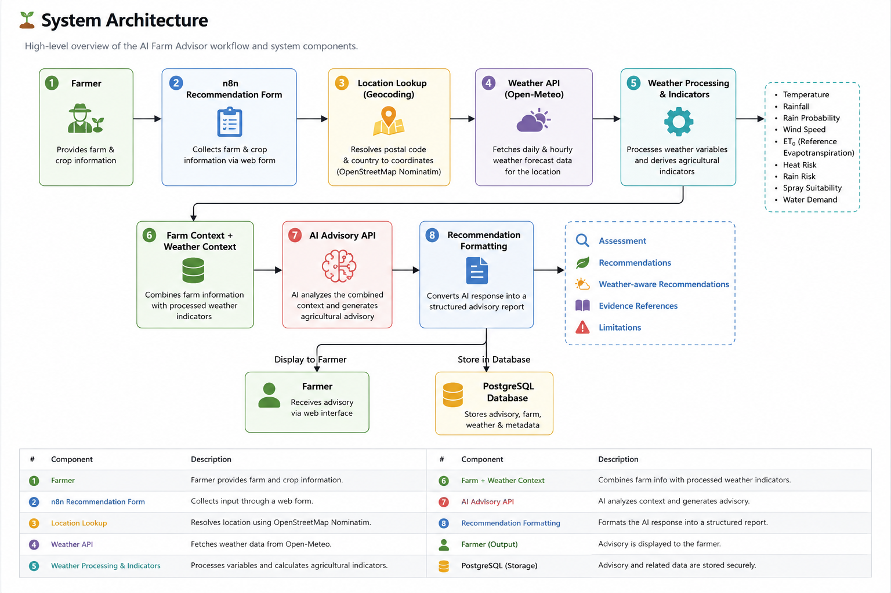

# AI Farm Advisor 🌾

An AI-powered agricultural advisory system that combines farm information, weather data, and AI reasoning to generate practical field recommendations.

## Overview

AI Farm Advisor is an automation-based agricultural decision-support system built with **n8n** and an AI advisory backend.

The system collects farm and crop information from a farmer, retrieves location-specific weather data, processes agricultural weather indicators, and sends the combined context to an AI advisory service.

The generated advisory is then formatted into a structured report containing:

- Field assessment
- Agricultural recommendations
- Weather-aware recommendations
- Evidence references
- Limitations

## System Architecture



```text
Farmer
  │
  ▼
n8n Recommendation Form
  │
  ├── Farm & Crop Information
  │
  ▼
Location Lookup
  │
  ▼
Weather API
  │
  ▼
Weather Processing
  │
  ├── Temperature
  ├── Rainfall
  ├── Rain Probability
  ├── Wind Speed
  ├── ET₀
  ├── Heat Risk
  ├── Rain Risk
  ├── Spray Suitability
  └── Water Demand
  │
  ▼
Farm Context + Weather Context
  │
  ▼
AI Advisory API
  │
  ▼
Recommendation Formatting
  │
  ├── Assessment
  ├── Recommendations
  └── Limitations
  │
  ├──────────────► Farmer
  │
  └──────────────► PostgreSQL
## Workflow

The current n8n workflow contains the following main stages:

### 1. Farm Data Collection

The farmer provides:

- Field ID
- Crop
- Variety
- Agronomical stage
- Irrigation availability
- Planting/sowing date
- Field area
- Postal/ZIP code
- Country code

### 2. Location Resolution

The submitted postal code and country information are used to obtain geographic coordinates for the farm.

### 3. Weather Retrieval

Location-specific weather data is retrieved for the farm, including daily and hourly forecast information.

### 4. Weather Processing

The workflow processes weather variables and derives:

- Heat risk
- Rain risk
- Spray suitability
- Water demand
- Reference evapotranspiration (ET₀)

### 5. Farm Context Preparation

Farm information such as crop, variety, growth stage, irrigation availability, planting date, field area, and days after planting is combined with the weather context.

### 6. AI Advisory

The combined farm and weather context is sent to the AI advisory backend for agricultural analysis.

### 7. Recommendation Formatting

The AI response is converted into a structured advisory containing:

- Assessment
- Recommendations
- Limitations

### 8. Advisory Storage

The workflow connects to PostgreSQL for storing advisory information.

## Technology Stack

- **Automation:** n8n
- **Programming:** Python, JavaScript
- **Weather Data:** Open-Meteo
- **Geocoding:** OpenStreetMap Nominatim
- **Database:** PostgreSQL
- **AI:** AI advisory backend

## Project Structure

```text
ai-farm-advisor/
│
├── n8n/
│   └── ai-farm-weather-agent.json
│
├── README.md
│
└── .gitignore
## Current Capabilities

- Farm-specific advisory generation
- Weather-aware agricultural recommendations
- Daily and hourly weather processing
- ET₀-based water-demand classification
- Heat-risk classification
- Rain-risk classification
- Spray-suitability assessment
- Structured advisory output
- PostgreSQL integration

## Limitations

The system is currently a working prototype and should be further validated with field data before production deployment.

The quality of the advisory depends on the accuracy and completeness of the submitted farm information and available weather data.

The current implementation should be considered a decision-support system rather than a replacement for professional agronomic assessment.

## Future Development

Planned improvements include:

- Sensor-based farm data integration
- Automated recurring farm advisories
- Critical-condition alerts
- Historical farm-data analysis
- Crop-specific decision rules
- Improved agronomic validation
- More advanced AI agent orchestration
- Production deployment and monitoring

## Project Status

**Status:** Working prototype

The current implementation demonstrates an end-to-end automated pipeline from farmer input and weather data to an AI-generated agricultural advisory.

## Author

**Yatin Madaan**

MSc Digital Farming  
HSWT – Weihenstephan-Triesdorf University of Applied Sciences